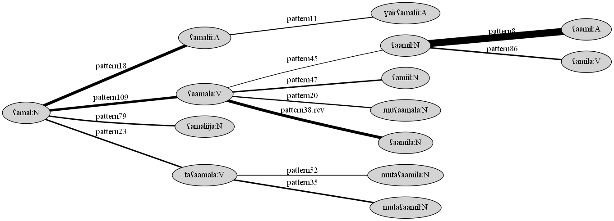
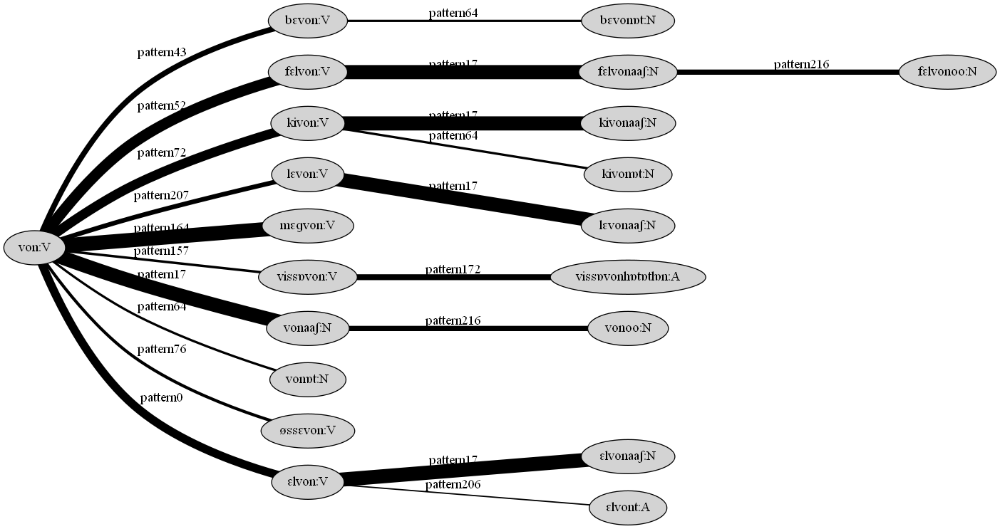

# Colexification

This command-line program can extract derivational morphology from raw lexical data and use these patterns to cluster related word forms.

The .jar file can be downloaded [here](https://github.com/tdaneyko/colexification/releases/download/v1.0/colex.jar).




## Usage

### Clustering Program

**Command:** `java -jar colex.jar -mode <mode(s)> -data <datafile> <additional files if required>`

Possible values for `-mode` (multiples are possible, divided by whitespace):

* `align` - retrieves patterns with frequencies (this can take several minutes)

* `rank` - weighs patterns, requires additional `-patterns <output of align>` if run without `align`
	
* `patterns` - combination of `align` and `rank`
	
* `nocomb` - removes combination patterns, requires additional `-patterns <output of rank>` if run without `patterns` (NOT RECOMMENDED)
	
* `cluster` - clusters data based on provided patterns, requires additional `-patterns <output of rank>` if run without `patterns` (this can take several minutes)
	
* `clean` - removes unnecessary connections from clusters, requires additional `-clusters <output of cluster>` if run without `cluster`
	
* `clcl` - combination of `cluster` and `clean`, requires additional `-patterns <output of rank>` if run without `patterns`
	
* `all` - combination of `align`, `rank`, `cluster` and `clean`
	
* `allcl` - combination of `align`, `rank`, `nocomb`, `cluster` and `clean` (NOT RECOMMENDED)
	

**Example:**

`java -jar colex.jar -mode rank cluster -data hu-data.tsv -patterns hu-frequencies`

(Ranks patterns from `hu-frequencies` and clusters words from `hu-data.tsv` using these patterns.)


### Graph Program

**Prerequisites:** [Graphviz](https://graphviz.org/)

**Command:** `java -jar colex.jar -graph -in <infile> -out <outfile-prefix> -id|-minsize|-top <value>`

* `-id`: Print single cluster with id `<value>`
* `-minsize`: Print all clusters with a minimum size of `<value>`
* `-top`: Print top `<value>` clusters


**Example:**

`java -jar colex.jar -graph -in hu-clusters -out hu -id 2`

(Prints tree for the cluster with id 2 in `hu-clusters` to a file called `hu-2.png`.)


## Example

In the input data file, each line needs to be in the following format:

`<Translation>::<PoS>	<Word1>#<Transcription1>/<Word2>#<Transcription2>/...`

For instance, some lines from a Hungarian data file `hu-data.tsv` could look like this:

```
anhalten::V	megáll#mɛɡaall
entziehen::V	elvon#ɛlvon/megvon#mɛɡvon
hinzuziehen::V	bevon#bɛvon
stehen::V	áll#aall
Stehen::N	állás#aallaaʃ
subtrahieren::V	kivon#kivon/levon#lɛvon
ziehen::V	húz#huuz/von#von
```

The translation field can also be left empty, it is not used. The PoS tags do not need to conform to some standard, they are just needed for the system to detect PoS-changing derivation. The transcription also does not necessarily need to be IPA. In the case of Hungarian, even the orthography could function as a transcription since it is rather phonemic.

Running `java -jar colex.jar -mode patterns -data hu-data.tsv` will yield a file `hu-data.tsv.ranks` which contains the detected derivational patterns ranked according to how regularly they occur. For our Hungarian file, the top 10 lines look like this, where the columns contain (1) the pattern name (which can be changed manually to something more useful), (2) the ranking score, and (3) the pattern:

```
pattern99	3520	./. A/N
pattern238	3520	./. N/A
pattern118	1524	m/- ɛ/- ɡ/- ./. V/V
pattern164	1524	-/m -/ɛ -/ɡ ./. V/V
pattern174	1488	./. a/- a/- ʃ/- N/V
pattern17	1488	./. -/a -/a -/ʃ V/N
pattern178	1164	./. e/- e/- ʃ/- N/V
pattern44	1164	./. -/e -/e -/ʃ V/N
pattern144	1158	f/- ɛ/- l/- ./. V/V
pattern52	1158	-/f -/ɛ -/l ./. V/V
```

The system has detected that Hungarian nouns and adjectives can be derived from each other without any morphological changes, and has found the very common verbal prefixes _meg-_ and _fel-_ as well as the nominalizing _-ás/-és_.

In the pattern string, `./.` stands for a substring that remains unchanged, while `i/o` marks a transition from symbol `i` to `o`. The final transition is always the PoS.

Running `java -jar colex.jar -mode clcl -data hu-data.tsv -patterns hu-data.tsv.ranks` will now cluster derivationally related word forms together in a file called `hu-data.tsv.clclus`. We will, for instance, find a cluster surrounding the verb _von_:

```
8	von:V
von:V	pattern43	584	bɛvon:V
von:V	pattern72	1004	kivon:V
von:V	pattern207	492	lɛvon:V
von:V	pattern164	1524	mɛɡvon:V
von:V	pattern0	888	ɛlvon:V
kivon:V	pattern17	1488	kivonaaʃ:N
kivon:V	pattern64	244	kivonɒt:N
lɛvon:V	pattern17	1488	lɛvonaaʃ:N
...
```

The first line of this cluster indicates the cluster id and root form. It then lists the derivations between the cluster's members: `von:V`, for example, has a derivation `mɛɡvon:V` via pattern `pattern164`. The score that indicates how sure the system is that this is actually a valid derivation (direction) is `1524`.

We can now visualize the _von_ cluster by running `java -jar colex.jar -graph -in hu-data.tsv.clclus -out hu -id 8` to generate an image `hu-8.png`:


